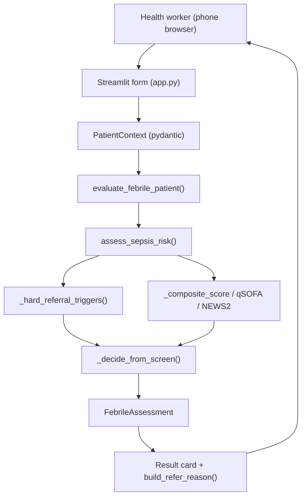

# FeverGate — Engineering Design Doc

**Author:** TBD
**Status:** Draft v0.1
**Last updated:** 2026-06-26
**Reviewers:** TBD

---

## 1. Summary

FeverGate is a non-laboratory treat-or-refer decision aid for febrile patients of all ages. The system is a small, deterministic Python rule engine (`evaluate_febrile_patient`) wrapped in a single-page Streamlit UI. There is no network service, no database server, and no LLM in the decision path — the entire decision is a pure function over a typed `PatientContext`. The single most interesting engineering choice is making safety a *structural* property rather than a tested-after-the-fact one: any positive WHO IMCI danger sign at any age flows through one hard-referral gate that short-circuits the rest of the logic, so "a danger sign always refers" is true by construction and then pinned by an exhaustive parametrized test suite.

## 2. Assumptions

Each of these, if wrong, changes the design.

- **Target scale:** Single worker on a single device per session; low hundreds of encounters/day per device. No concurrency, no multi-tenant load.
- **Latency budget:** The decision is a local pure function; p99 well under 10ms. The only perceptible latency is Streamlit's rerun, not the engine.
- **Platform:** Mobile-friendly web via Streamlit, run from a phone browser or a hosted demo. Not a native app; not yet an offline PWA.
- **Cost ceiling:** Effectively zero marginal cost per decision (no model calls, no cloud DB). Hosting a Streamlit demo is the only cost.
- **Out of scope:** Multi-region, real-time sync, accounts, lab/RDT integration, SMS/notifications, central registry.

If FeverGate ever needs true offline-install or shared encounter data, revisit Sections 4 and 6.

## 3. Goals & non-goals

**Goals (v1):**
- Deterministic, auditable engine returning `REFER_IMMEDIATE` / `REFER` / `TREAT_AND_MONITOR` / `TREAT` with referral reasons.
- Any positive IMCI danger sign, at any age, always yields a referral decision (the safety invariant).
- Neonate (<2 months) with fever always refers immediately.
- A Streamlit triage form → result-card flow that is usable end-to-end in under 60 seconds.
- Decision latency p99 < 10ms (local pure function); UI swap form→card with no wrong-color flash on referral.

**Non-goals (v1):**
- No LLM anywhere in the decision path — explanation narration is a later, non-deciding layer.
- No persistence beyond in-session `st.session_state`; no encounter database.
- Designed for single-device use; will not scale to a shared multi-user backend without rework — and that's fine.
- No vitals-driven adult pathways beyond the existing qSOFA/NEWS2/composite screen; no new clinical scope in v1.

## 4. Architecture



**What's here:**
- **Streamlit app (`app.py`)** — renders the form and the result card; maps tiles to `PatientContext`; owns view state.
- **Decision engine (`src/decision_engine/`)** — `engine.py` orchestrator + `sepsis_screen.py` rules over typed `models.py`.
- **Shared label map (`DANGER_SIGN_LABELS` in `models.py`)** — single source of truth for reason wording, consumed by both tests and UI.
- **UI tile metadata (`src/ui/danger_sign_labels.py`)** — maps each tile to a `DangerSigns` field or `ConsciousnessLevel`.

**What's deliberately NOT here:**
- No backend API or server — the engine is imported in-process; there is nothing to deploy beyond the Streamlit app.
- No database — encounter state lives in `st.session_state` for the session and is discarded; a registry is a non-goal.
- No LLM / model service — the decision is a pure function; nothing to call, rate-limit, or pay for.
- No auth / session service — one worker, one device, zero accounts.

## 5. Key components

### Decision orchestrator — `engine.py`

- **Responsibility:** Turn a `PatientContext` into a `FebrileAssessment` (decision, urgency, monitoring days, deduped referral reasons, rationale).
- **Tech choice:** Plain Python + pydantic v2.
- **Why this choice:** Already in the stack; pydantic gives typed, validated inputs for free, which is what keeps UI-side errors near-impossible.
- **Interface:** `evaluate_febrile_patient(ctx: PatientContext) -> FebrileAssessment`.

### Sepsis / danger-sign screen — `sepsis_screen.py`

- **Responsibility:** Compute hard-referral triggers, qSOFA, NEWS2, and a composite score, then resolve a decision + urgency.
- **Tech choice:** Pure functions, no I/O.
- **Why this choice:** Determinism and testability — every branch is reachable from a constructed `PatientContext`.
- **Interface:** `assess_sepsis_risk(ctx) -> SepsisScreenResult`; internals `_hard_referral_triggers`, `_imci_danger_signs`, `_compute_qsofa`, `_compute_news2`, `_composite_score`, `_decide_from_screen`, `_age_band`.

### Domain models — `models.py`

- **Responsibility:** Typed inputs/outputs and the canonical `DANGER_SIGN_LABELS` reason map.
- **Tech choice:** pydantic `BaseModel` + `Enum`.
- **Why this choice:** Validation at the boundary; enums prevent invalid decisions/urgencies/consciousness states.
- **Interface:** `PatientContext`, `VitalSigns`, `DangerSigns`, `ConsciousnessLevel`, `Comorbidity`, `TriageDecision`, `ReferralUrgency`, `FebrileAssessment`, `DANGER_SIGN_LABELS`.

### Streamlit UI — `app.py` + `src/ui/danger_sign_labels.py`

- **Responsibility:** Render form/result, map tiles → context, build the human reason line, manage form↔card state.
- **Tech choice:** Streamlit; `DANGER_SIGN_TILES` dataclass list for tile metadata.
- **Why this choice:** Fastest path to a mobile-friendly, deployable demo with no frontend build chain.
- **Interface:** `build_refer_reason(referral_reasons, urgency) -> str`; `render_form()`, `render_result()`, `main()`.

## 6. Data model

The "data model" is the in-memory contract; nothing is persisted to disk in v1.

```python
class ConsciousnessLevel(str, Enum):
    ALERT = "alert"; IRRITABLE = "irritable"
    LETHARGIC = "lethargic"; UNCONSCIOUS = "unconscious"

class TriageDecision(str, Enum):
    REFER_IMMEDIATE = "REFER_IMMEDIATE"; REFER = "REFER"
    TREAT_AND_MONITOR = "TREAT_AND_MONITOR"; TREAT = "TREAT"

class DangerSigns(BaseModel):
    unable_to_drink_or_breastfeed: bool = False
    vomits_everything: bool = False
    convulsions: bool = False
    chest_indrawing: bool = False
    stiff_neck: bool = False
    bulging_fontanelle: bool = False
    severe_palmar_pallor: bool = False

class PatientContext(BaseModel):
    age_months: int = Field(ge=0)
    has_fever: bool = True
    fever_duration_days: int = Field(default=1, ge=0)
    consciousness: ConsciousnessLevel = ConsciousnessLevel.ALERT
    toxic_appearance: bool = False
    comorbidities: list[Comorbidity] = Field(default_factory=list)
    vitals: VitalSigns = Field(default_factory=VitalSigns)
    danger_signs: DangerSigns = Field(default_factory=DangerSigns)

class FebrileAssessment(BaseModel):
    sepsis: SepsisScreenResult
    decision: TriageDecision
    urgency: ReferralUrgency
    monitoring_days: int = 0
    referral_reasons: list[str] = Field(default_factory=list)
    rationale: list[str] = Field(default_factory=list)
```

**Notes:**
- No indexing / no tables — there is no datastore. `st.session_state` holds the current `FebrileAssessment` and form inputs only.
- Retention: session-scoped; cleared on "New patient" or browser close. No PII leaves the device.
- `referral_reasons` are stable string codes (e.g. `imci:convulsions`, `neonate_fever`); human wording is resolved separately via `DANGER_SIGN_LABELS`, so codes can be tested without coupling to display copy.

## 7. API surface

FeverGate has no network API. The boundary that matters is the **internal call graph**, treated with the same rigor.

### `evaluate_febrile_patient(ctx: PatientContext) -> FebrileAssessment`

- **Input:** A validated `PatientContext`.
- **Output:** `FebrileAssessment` with `decision`, `urgency`, `monitoring_days`, sorted/deduped `referral_reasons`, and `rationale`.
- **Errors:** Invalid inputs are rejected at construction by pydantic (e.g. negative `age_months`), so the function itself does not raise on well-formed contexts.
- **Latency budget:** Pure CPU, no I/O; p99 < 10ms.

### `build_refer_reason(referral_reasons: list[str], urgency: ReferralUrgency) -> str`

- **Input:** The engine's reason codes + the urgency enum.
- **Output:** One human line, e.g. `"Convulsions — refer immediately."`, built from `DANGER_SIGN_LABELS` (+ a small extra-reason map / `news2>=` prefix handling), deduped.
- **Errors:** Unknown codes are skipped; empty result falls back to "Elevated severe-illness screen".
- **Latency budget:** Negligible (string assembly).

## 8. Key trade-offs (with rejected alternatives)

### Decision: Deterministic rule engine vs. LLM-in-the-loop

- **Chose:** A pure-function rule engine; no model in the decision path.
- **Considered:** An LLM that reads the inputs and recommends treat/refer.
- **Considered:** A hybrid where an LLM adjusts rule output.
- **Why we picked this:** Safety must be auditable and reproducible — the same inputs must always produce the same referral. An LLM can hallucinate a "treat" over a danger sign; we cannot accept that risk. We give up flexible natural-language reasoning, which we don't need for a tap-based form.

### Decision: Apply IMCI danger signs at all ages vs. under-5 only

- **Chose:** Any positive IMCI danger sign hard-refers at every age.
- **Considered:** Gating IMCI signs to neonate/under-5 (the original protocol scope).
- **Why we picked this:** The product's safety promise is "a positive danger sign always refers." An age gate meant an 8-year-old with chest indrawing could fall through to TREAT_AND_MONITOR — a false negative, the exact failure we refuse. We accept a slightly higher refer rate in older children in exchange for eliminating that class of miss.

### Decision: On-device session state vs. a persistent encounter store

- **Chose:** `st.session_state` only; nothing persisted.
- **Considered:** SQLite-on-device encounter log; cloud registry.
- **Why we picked this:** Persistence and registry are explicit non-goals and would add storage, schema, and privacy surface that must never block the bedside decision. We give up audit history in v1; the reason-code design leaves a clean seam to add a log later.

### Decision: Streamlit vs. a custom web frontend

- **Chose:** Streamlit single-page app.
- **Considered:** React/Next PWA; native mobile.
- **Why we picked this:** Streamlit ships a mobile-friendly UI with zero build chain and trivial hosting, which fits a prototype/submission timeline. We give up fine-grained control over the snap animation and true offline install — acceptable for v1, revisit for field deployment.

## 9. Risks & unknowns

- **Clinical correctness of thresholds** — Likelihood: med — Mitigation: thresholds encode WHO IMCI / qSOFA / NEWS2; pin behavior with golden tests and flag for clinician review before any real-world use.
- **Over-referral in older children from all-age danger signs** — Likelihood: med — Accepted: a false *positive* (unnecessary refer) is tolerable; a false *negative* is not. Monitor refer rate if deployed.
- **Streamlit rerun causes a visible flicker / wrong-color flash on the snap** — Likelihood: low — Mitigation: gate rendering on a single `show_result` flag so the form and card never co-render.
- **Reason wording drifts from engine codes** — Likelihood: low — Mitigation: `DANGER_SIGN_LABELS` is the single source consumed by both UI and tests.
- **Misuse as a diagnosis tool** — Likelihood: med — Mitigation: explicit "screening only" caption; product copy never claims diagnosis.

## 10. Testing strategy

This section is the test plan consumed by the `test-driven-dev` skill. It maps to the existing `tests/test_sepsis_screen.py` and `tests/test_danger_signs.py` and is the contract that keeps the suite small and safety-focused. Runner: **pytest**. Tests live in `tests/`, each adding `src/` to `sys.path` (matching the existing bootstrap). No browser automation, no visual regression.

**Unit tests (must have):**
- `_hard_referral_triggers(ctx)` — every IMCI danger sign present produces its `imci:*` trigger at an under-5 age *and* a school-age age (the all-age invariant); convulsions still emits the bare `"convulsions"` reason for backward compatibility.
- `_imci_danger_signs(ctx)` — each `DangerSigns` boolean and each of `ConsciousnessLevel.LETHARGIC` / `UNCONSCIOUS` maps to exactly the expected trigger code; no sign set → empty list.
- `_age_band(age_months)` — boundary cases: 1→neonate, 2→under5 boundary, 59/60, 144, 216, 780 (elderly) return the correct band.
- `_compute_qsofa(ctx)` — returns `None` under 12 years; for adults, ≥2 when lethargic/unconscious + low SBP + high RR combine.
- `_compute_news2(ctx)` — returns `None` when not applicable / RR missing; high derangement (low SpO2, hypothermia, hypotension, unconscious) pushes the score into the immediate-referral band (≥7).
- `_composite_score(ctx)` — neonate age points, hypothermia, lethargy, comorbidities, prolonged fever, and toxic appearance each add their documented increments and surface in `score_components`.
- `evaluate_febrile_patient(ctx)` — `monitoring_days == 3` only for `TREAT_AND_MONITOR`; `referral_reasons` are sorted and deduplicated; rationale is populated.
- `build_refer_reason(reasons, urgency)` (`app.py`) — `["imci:convulsions"]` + IMMEDIATE → `"Convulsions — refer immediately."`; SAME_DAY phrasing; multiple codes dedupe; unknown-only codes fall back to the generic line.
- `DANGER_SIGN_LABELS` — every `imci:*` code emitted by `_imci_danger_signs` has a label entry (guards UI/engine drift).

**Integration tests (one per major flow):**
- **Danger-sign refer flow** — `PatientContext(age_months=24, has_fever=True, danger_signs=DangerSigns(convulsions=True))` → `evaluate_febrile_patient` → `decision == REFER_IMMEDIATE` and `"convulsions"`/`imci:convulsions` in `referral_reasons`. (Function-call level, the engine's primary path.)
- **Neonate fever refer flow** — `PatientContext(age_months=1, has_fever=True)` → `decision == REFER_IMMEDIATE` and `"neonate_fever"` in `referral_reasons`.
- **Uncomplicated fever monitor flow** — under-5, mild vitals, no danger signs → `decision == TREAT_AND_MONITOR`, `monitoring_days == 3` (the negative/over-referral guard).
- **Adult deterioration flow** — adult with qSOFA-positive vitals → `decision in {REFER, REFER_IMMEDIATE}`, confirming the all-ages screen path.

**Deliberately not tested (and why):**
- Streamlit rendering, CSS, tile layout, and the snap transition — visual/runtime UI, verified by a human in a 60-second walkthrough; not worth brittle automation.
- Exact composite-score *numbers* beyond documented thresholds — we test decision boundaries, not every internal point value, to avoid locking in arithmetic that may be re-tuned.
- pydantic's own validation internals (e.g. that `age_months < 0` raises) — trust the library; we test our logic, not theirs.
- Clinical *accuracy* of the protocol itself (whether WHO thresholds are medically optimal) — that's clinician review, not a unit test.

**Stack default:** Python → `pytest`, run with `pytest tests/ -v` from the project root.

## 11. Rollout & monitoring

- **Rollout:** Hosted Streamlit demo for submission/review first; a supervised pilot on one or two clinic devices only after clinician sign-off.
- **Feature flags:** None needed in v1 — the single decision path ships whole. The eventual encounter-log and AI-explainer layers are the natural flag candidates.
- **Monitoring:** In a pilot, the signals worth watching are: refer-rate by age band (catch over-referral), any human-reported false negative (page-worthy — should be zero by design), and form-completion time (the <60s UX bar). No server metrics exist in v1.
- **Rollback plan:** It's a single app; rollback is redeploying the previous commit (`git revert`) or taking the demo offline. No data migration to unwind.

## 12. Cost & capacity

- **Per-decision cost:** ~$0 — pure local computation, no model calls, no DB reads.
- **Monthly budget at v1 scale:** Only the cost of hosting one Streamlit instance (a small container / free-tier dyno). Effectively negligible.
- **What breaks at 10× scale:** Nothing about the *decision* (it's CPU-trivial). The first thing to revisit at multi-clinic scale is shared encounter data and reporting — but that's the registry non-goal, deliberately not designed now.

## 13. Open questions

- [ ] Should lethargic/unconscious be one tri-state input or two tiles? — UX + Eng (affects `PatientContext` mapping).
- [ ] Do we add a session-local encounter log (SQLite) in v1, or keep state ephemeral? — Product owner.
- [ ] Which malaria-endemicity / presumptive-treatment rules (if any) enter the TREAT branch? — Clinical reviewer.
- [ ] What does "Refer now" record — a no-op, or the first hook of an encounter log? — Product + Eng.

## 14. Out of scope (will not do)

- **No backend service or REST API** — the engine is imported in-process; building an API would add deployment and auth surface we don't need.
- **No database or cloud registry** — would require schema, sync, and privacy work that must not block the bedside decision.
- **No LLM in the decision** — only ever a non-deciding explanation layer, later.
- **No lab/RDT input, no SMS/notifications, no accounts** — each is an explicit product non-goal that would pull engineering effort off the safety core.
- **No offline-installable PWA in v1** — Streamlit demo first; true offline is a field-deployment concern.
