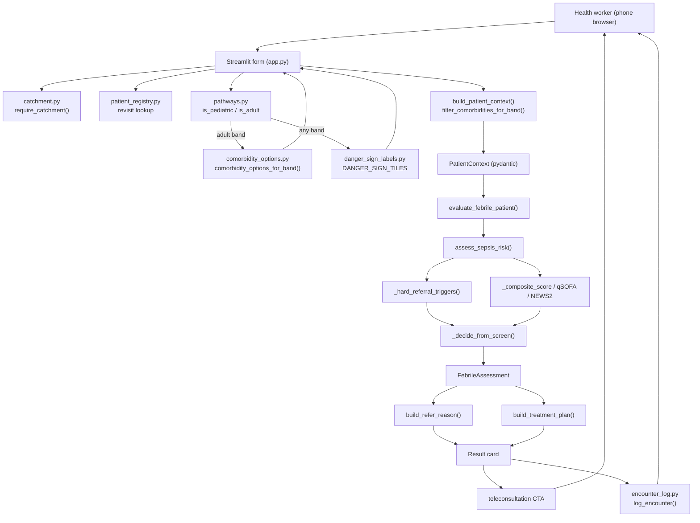

# FeverGate — Engineering Design Doc

**Author:** TBD
**Status:** Draft v0.1
**Last updated:** 2026-06-30
**Reviewers:** TBD

---

## 1. Summary

FeverGate is a non-laboratory treat-or-refer decision aid for febrile patients of all ages. The system is a deterministic Python rule engine (`evaluate_febrile_patient`) wrapped in a single-page Streamlit UI, managed with **uv** via `pyproject.toml`. There is no LLM in the decision path — the entire decision is a pure function over a typed `PatientContext`. The single most interesting engineering choices are **age-routed clinical pathways** (pediatric vs adult comorbidity capture), **mandatory catchment on every encounter** (epidemiologic reporting without blocking triage), **guideline-linked treatment plans** on the result card (presumptive ACT, antibiotics when in stock), and **local encounter logging** as a non-blocking fever registry. Teleconsultation handoff (immediate call on REFER, scheduled call on TREAT_AND_MONITOR) is a UI integration layer on top of the deterministic engine.

## 2. Assumptions

- **Target scale:** Single worker on a single device per session; low hundreds of encounters/day per device. No concurrency, no multi-tenant load.
- **Latency budget:** The decision is a local pure function; p99 well under 10ms. The only perceptible latency is Streamlit's rerun, not the engine.
- **Platform:** Mobile-friendly web via Streamlit, run from a phone browser or a hosted demo. Not a native app; not yet an offline PWA.
- **Cost ceiling:** Effectively zero marginal cost per decision (no model calls, no cloud DB). Hosting a Streamlit demo is the only cost.
- **Pathway split:** 15 years is the product boundary between pediatric and adult pathways in the UI; engine uses finer age bands internally (neonate, under-5, 5–12, adolescent, adult, elderly).
- **Brief constraints (from project README / OST):** Screening-only tool — does not diagnose sepsis; flags likely severe illness for referral. Safety invariant: any positive danger sign → REFER at any age.
- **Out of scope:** Multi-region real-time sync, accounts, lab/RDT integration, SMS/push notifications, central cloud registry, two-way in-app chat.

## 3. Goals & non-goals

**Goals (v1):**
- Deterministic, auditable engine returning `REFER_IMMEDIATE` / `REFER` / `TREAT_AND_MONITOR` / `TREAT` with referral reasons and **treatment-plan payloads** (drug, dose band, duration; stock- and endemicity-aware).
- Any positive IMCI danger sign, at any age and on either pathway, always yields a referral decision (the safety invariant).
- Neonate (<2 months) with fever always refers immediately.
- **Two UI pathways** derived from six age bands: pediatric (<15) with sickle cell + severe malnutrition; adult (15+) with full comorbidity grid.
- **Mandatory catchment** — `require_catchment()` at assess and log write; top-level `catchment` on every JSONL row; optional SQLite patient registration (name + village) for revisits.
- Optional vitals entry UI (BP, SpO₂, RR) feeding `VitalSigns` — engine already scores qSOFA/NEWS2 when present.
- Malaria endemicity + clinic stock context driving presumptive ACT on the TREAT branch.
- `build_patient_context()` filters comorbidities at the boundary per pathway.
- Result card with teleconsultation CTAs: immediate call (REFER), schedule call (TREAT_AND_MONITOR), start treatment (TREAT).
- **Local fever registry** — append-only JSONL on device; write after card render, never on the critical path.
- A Streamlit triage form → result-card flow usable end-to-end in under 60 seconds on both pathways.
- Decision latency p99 < 10ms (local pure function); UI swap form→card with no wrong-color flash on referral.

**Non-goals (v1):**
- No LLM anywhere in the decision path — explanation narration is a later, non-deciding layer.
- No cloud sync or central registry — local log only.
- Designed for single-device use; will not scale to a shared multi-user backend without rework — and that's fine.
- No two-way clinician chat — teleconsultation is outbound call / schedule only.
- No separate engine binaries per pathway — one engine, pathway-aware inputs.

## 4. Architecture



**What's here:**
- **Pathway router (`src/ui/pathways.py`)** — `PEDIATRIC_AGE_BANDS`, `ADULT_AGE_BANDS`, `is_pediatric_pathway()`, `is_adult_pathway()`; single source of truth for the <15 / 15+ split.
- **Streamlit app (`app.py`)** — renders form/result; shows comorbidity section only when pathway requires it.
- **UI helpers (`src/ui/`)** — `catchment.py` (normalize + require village/catchment), `patient_registry.py` (SQLite revisit list), `danger_sign_labels.py` (tile metadata), `patient_context.py` (form→model), `comorbidity_options.py` (organ-system toggles for adult pathway), `refer_reason.py` (human reason lines), `clinic_context.py` (endemicity + stock), `treatment_plan.py`, `teleconsultation.py`, `encounter_log.py`.
- **Decision engine (`src/decision_engine/`)** — `engine.py` orchestrator + `sepsis_screen.py` rules over `models.py`.
- **Optional explainer (`src/explainer/`)** — non-deciding Gemini narration; never in decision path.

**What's deliberately NOT here:**
- No backend API or server — the engine is imported in-process.
- No cloud database — encounter state in `st.session_state` for the session; fever registry is local JSONL only.
- No LLM / model service in the decision path — the decision is a pure function.
- No auth / session service — one worker, one device, zero accounts.
- No duplicate engines per pathway — pathway differences are input gating + age-stratified scoring inside one engine.

## 5. Key components

### Pathway router — `src/ui/pathways.py`

- **Responsibility:** Define which age bands belong to the pediatric vs adult clinical pathway and expose predicate helpers for UI gating.
- **Tech choice:** Plain Python constants + functions.
- **Why this choice:** One module prevents drift between `app.py`, `comorbidity_options.py`, and `patient_context.py` on the 15-year boundary.
- **Interface:**

```python
PEDIATRIC_AGE_BANDS: frozenset[str]  # Under 2 mo, 2 mo–5 yr, 5–15 yr
ADULT_AGE_BANDS: frozenset[str]      # 15–17, 18–64, 65+
def is_pediatric_pathway(age_band: str) -> bool
def is_adult_pathway(age_band: str) -> bool
def age_bands_for_pathway(pathway_label: str) -> tuple[str, ...]
```

### Decision orchestrator — `src/decision_engine/engine.py`

- **Responsibility:** Turn a `PatientContext` into a `FebrileAssessment` (decision, urgency, monitoring days, deduped referral reasons, rationale).
- **Tech choice:** Plain Python + pydantic v2.
- **Why this choice:** Already in the stack; pydantic gives typed, validated inputs for free.
- **Interface:** `evaluate_febrile_patient(ctx: PatientContext) -> FebrileAssessment`.

### Sepsis / danger-sign screen — `src/decision_engine/sepsis_screen.py`

- **Responsibility:** Compute hard-referral triggers, age-stratified qSOFA/NEWS2, and a composite score, then resolve a decision + urgency.
- **Tech choice:** Pure functions, no I/O.
- **Why this choice:** Determinism and testability — every branch is reachable from a constructed `PatientContext`.
- **Interface:** `assess_sepsis_risk(ctx)`; internals `_hard_referral_triggers`, `_imci_danger_signs`, `_compute_qsofa`, `_compute_news2`, `_composite_score`, `_decide_from_screen`, `_age_band`.

### Comorbidity options — `src/ui/comorbidity_options.py`

- **Responsibility:** Define underlying-disease toggles grouped by organ system for adult pathway; reduced set (sickle cell, severe malnutrition) for pediatric pathway; filter submitted comorbidities at context build.
- **Tech choice:** Frozen dataclass list + `comorbidity_options_for_band()` / `filter_comorbidities_for_band()`.
- **Why this choice:** Keeps UI metadata out of `app.py`; enforces pathway-appropriate comorbidity capture even if Streamlit session state is stale.
- **Interface:** `comorbidity_options_for_band(age_band) -> list[ComorbidityOption]`, `filter_comorbidities_for_band(age_band, comorbidities) -> list[Comorbidity]`, `options_by_system(age_band) -> dict[str, list[ComorbidityOption]]`.

### Patient context builder — `src/ui/patient_context.py`

- **Responsibility:** Map form selections (tiles, age band, fever, vitals) to a validated `PatientContext`; strip disallowed comorbidities for pediatric bands.
- **Tech choice:** Plain Python calling `filter_comorbidities_for_band()`.
- **Why this choice:** Boundary between UI state and engine input — the last place to enforce pathway rules.
- **Interface:** `build_patient_context(age_band, has_fever, fever_duration_days, selected_tiles, comorbidities=None, systolic_bp=None, spo2_percent=None, respiratory_rate=None) -> PatientContext`.

### Treatment plan builder — `src/ui/treatment_plan.py`

- **Responsibility:** Turn `FebrileAssessment` + `PatientContext` + `ClinicContext` into a `TreatmentPlan` (summary, detail, primary CTA label). Stock- and endemicity-aware presumptive ACT on treat/monitor branches.
- **Interface:** `build_treatment_plan(ctx, assessment, clinic) -> TreatmentPlan`.

### Catchment validation — `src/ui/catchment.py`

- **Responsibility:** Normalize and require village/catchment on every encounter for epidemiologic reporting.
- **Tech choice:** Plain Python string helpers — no external geo database in v1.
- **Why this choice:** Catchment is metadata, not a clinical input to the engine; validation stays out of `PatientContext` and lives at the UI/log boundary.
- **Interface:** `normalize_catchment(value: str) -> str`, `require_catchment(value: str) -> str` (raises `ValueError` if blank after normalize).

### Patient registry — `src/ui/patient_registry.py`

- **Responsibility:** Optional SQLite registration (name + village), revisit lookup filtered by village, `resolve_patient_for_encounter()` on assess.
- **Interface:** `list_villages()`, `list_recent_patients(village=None)`, `resolve_patient_for_encounter(name, village, patient_id=None) -> RegisteredPatient | None`.

### Local encounter log — `src/ui/encounter_log.py`

- **Responsibility:** Append-only JSONL fever registry on device; fire-and-forget after card actions. Every row includes top-level `catchment`; `registration` block optional when a named patient is linked.
- **Interface:** `log_encounter(ctx, assessment, clinic, catchment, action_taken=None, log_path=None, registered_patient_id=None, registered_name=None, registered_village=None) -> Path`.

### Teleconsultation stubs — `src/ui/teleconsultation.py`

- **Responsibility:** Dial URL and schedule-note copy for result-card CTAs (no in-app VoIP in v1).
- **Interface:** `teleconsultation_dial_url()`, `schedule_teleconsultation_note(monitoring_days)`.

### Optional explainer — `src/explainer/narrate.py`

- **Responsibility:** Non-deciding Gemini narration of rule-engine output. **Not** in the decision path.
- **Interface:** `narrate_assessment(assessment) -> str`; `get_client()` in `gemini_client.py` (patch in tests).

### Streamlit UI — `app.py` + `src/ui/`

- **Responsibility:** Render form/result; pathway-specific comorbidity blocks; clinic context + optional vitals; build treatment plan and reason lines; teleconsultation CTAs; manage form↔card state.
- **Tech choice:** Streamlit; `DANGER_SIGN_TILES` dataclass list for tile metadata.
- **Why this choice:** Fastest path to a mobile-friendly, deployable demo with no frontend build chain.
- **Interface:** `render_form()`, `render_result()`, `reset_to_form()`.

## 6. Data model

```python
# src/ui/pathways.py
AGE_BANDS: dict[str, int] = {
    "Under 2 months": 1,
    "2 months – 5 years": 24,
    "5–15 years": 96,
    "15–17 years": 192,
    "18–64 years": 480,
    "65+ years": 840,
}
PEDIATRIC_AGE_BANDS = frozenset({"Under 2 months", "2 months – 5 years", "5–15 years"})
ADULT_AGE_BANDS = frozenset({"15–17 years", "18–64 years", "65+ years"})

class Comorbidity(str, Enum):
    HIV = "hiv"
    IMMUNOSUPPRESSION = "immunosuppression"
    SEVERE_MALNUTRITION = "severe_malnutrition"
    SICKLE_CELL = "sickle_cell"
    CHRONIC_HEART_DISEASE = "chronic_heart_disease"
    CHRONIC_LUNG_DISEASE = "chronic_lung_disease"
    CHRONIC_KIDNEY_DISEASE = "chronic_kidney_disease"
    PREGNANCY = "pregnancy"
    RECENT_SURGERY_OR_WOUND = "recent_surgery_or_wound"

class DangerSigns(BaseModel):
    unable_to_drink_or_breastfeed: bool = False
    vomits_everything: bool = False
    convulsions: bool = False
    chest_indrawing: bool = False
    stiff_neck: bool = False
    bulging_fontanelle: bool = False
    severe_palmar_pallor: bool = False

class PatientContext(BaseModel):
    age_months: int = Field(ge=0)
    has_fever: bool = True
    fever_duration_days: int = Field(default=1, ge=0)
    consciousness: ConsciousnessLevel = ConsciousnessLevel.ALERT
    toxic_appearance: bool = False
    comorbidities: list[Comorbidity] = Field(default_factory=list)
    vitals: VitalSigns = Field(default_factory=VitalSigns)
    danger_signs: DangerSigns = Field(default_factory=DangerSigns)

class FebrileAssessment(BaseModel):
    sepsis: SepsisScreenResult
    decision: TriageDecision
    urgency: ReferralUrgency
    monitoring_days: int = 0
    referral_reasons: list[str] = Field(default_factory=list)
    rationale: list[str] = Field(default_factory=list)
```

**Notes:**
- No indexing / no tables — `st.session_state` holds the current `FebrileAssessment` and `catchment`; fever registry is append-only JSONL in `data/encounters.jsonl`.
- **Encounter row shape (JSONL):** `{ timestamp, catchment, registration?, patient, clinic, assessment, action_taken }` — `catchment` always present; `registration` null when anonymous encounter.
- Retention: session-scoped UI state; registry rows persist on disk until cleared manually.
- Pediatric pathway: `comorbidities` after `filter_comorbidities_for_band()` may include `SICKLE_CELL` and/or `SEVERE_MALNUTRITION` only.
- Adult pathway: up to nine comorbidities flow into `_composite_score()`.
- `referral_reasons` are stable string codes (e.g. `imci:convulsions`, `neonate_fever`); human wording via `DANGER_SIGN_LABELS`.

## 7. API surface

FeverGate has no network API. The internal call graph:

### `evaluate_febrile_patient(ctx: PatientContext) -> FebrileAssessment`

- **Input:** A validated `PatientContext` (pediatric pathway: at most sickle cell + severe malnutrition after filtering).
- **Output:** `FebrileAssessment` with `decision`, `urgency`, `monitoring_days`, sorted/deduped `referral_reasons`, and `rationale`.
- **Errors:** Invalid inputs rejected at construction by pydantic.
- **Latency budget:** Pure CPU, no I/O; p99 < 10ms.

### `build_patient_context(...) -> PatientContext`

- **Input:** Age band label, fever flags, danger-sign tile map, optional `list[Comorbidity]`, optional vitals.
- **Output:** Validated `PatientContext` with pathway-filtered comorbidities.
- **Errors:** Unknown age band raises `KeyError` (Streamlit selectbox prevents this in normal use).
- **Latency budget:** Negligible.

### `is_adult_pathway(age_band: str) -> bool` / `comorbidity_options_for_band(age_band) -> list`

- **Input:** UI age band string.
- **Output:** Boolean gate for comorbidity UI; pediatric returns two options, adult returns nine.
- **Errors:** Unknown band returns `False` / `[]` (no match in frozensets).
- **Latency budget:** Negligible.

### `log_encounter(..., catchment: str, ...) -> Path`

- **Input:** Patient context, assessment, clinic, **required catchment string**, optional action and registration fields.
- **Output:** Path to appended JSONL file.
- **Errors:** Blank catchment rejected by `require_catchment()` with `ValueError`.
- **Latency budget:** Single append; non-blocking relative to UI.

### `require_catchment(value: str) -> str`

- **Input:** Raw village/catchment string from form or revisit record.
- **Output:** Whitespace-normalized non-empty string.
- **Errors:** `ValueError` if empty after strip/normalize.
- **Latency budget:** Negligible.

### `build_refer_reason(referral_reasons: list[str], urgency: ReferralUrgency) -> str`

- **Input:** Engine reason codes + urgency enum.
- **Output:** One human line, e.g. `"Convulsions — refer immediately."`
- **Errors:** Unknown codes skipped; empty result falls back to `"Elevated severe-illness screen — refer immediately."`
- **Latency budget:** Negligible (string assembly).

### `build_treatment_plan(ctx, assessment, clinic) -> TreatmentPlan`

- **Input:** Patient context, engine assessment, clinic stock/endemicity.
- **Output:** `TreatmentPlan` with `summary`, `detail`, `primary_action_label`.
- **Errors:** None expected for valid assessment enums.
- **Latency budget:** Negligible.

## 8. Key trade-offs (with rejected alternatives)

### Decision: Pathway split at 15 years in UI vs. per-band bespoke forms

- **Chose:** Two pathways (`<15` pediatric with reduced comorbidities, `15+` adult with full grid) over six age bands.
- **Considered:** Separate screens per age band; comorbidities on all bands; a manual "child/adult" toggle.
- **Why we picked this:** Matches clinical practice (IMCI for children, chronic-disease modifiers for adolescents/adults) without six different forms. A manual toggle duplicates what age band already communicates.

### Decision: Mandatory catchment at UI boundary vs. optional registry-only village

- **Chose:** `require_catchment()` blocks assess and is required on `log_encounter()`; every JSONL row has top-level `catchment`.
- **Considered:** Village only when patient name is registered; infer catchment from clinic location.
- **Why we picked this:** Epidemiologic reporting needs geographic attribution on every encounter, including anonymous walk-ins. One required field with pick-or-type UX keeps friction low.

### Decision: Filter comorbidities at context build vs. trust UI gating alone

- **Chose:** `filter_comorbidities_for_band()` in `build_patient_context()` strips disallowed comorbidities.
- **Considered:** Rely on Streamlit not rendering the comorbidity block for pediatric bands.
- **Why we picked this:** Session state can be stale if a worker switches from adult to pediatric without resetting toggles. Defense in depth at the engine boundary.

### Decision: Deterministic rule engine vs. LLM-in-the-loop

- **Chose:** Pure-function rule engine; no model in the decision path.
- **Considered:** LLM that reads inputs and recommends treat/refer; hybrid where LLM adjusts rule output.
- **Why we picked this:** Safety must be auditable and reproducible on both pathways. An LLM can hallucinate "treat" over a danger sign.

### Decision: Apply IMCI danger signs at all ages vs. under-5 only

- **Chose:** Any positive IMCI danger sign hard-refers at every age on both pathways.
- **Considered:** Gating IMCI signs to neonate/under-5 (original protocol scope).
- **Why we picked this:** The safety promise is "a positive danger sign always refers." An age gate let a school-age child with chest indrawing fall through to TREAT_AND_MONITOR.

### Decision: Streamlit vs. custom web frontend

- **Chose:** Streamlit single-page app with conditional `st.subheader` for comorbidities.
- **Considered:** React/Next PWA; native mobile.
- **Why we picked this:** Ships a mobile-friendly UI with zero build chain for a submission timeline. We give up fine-grained snap animation control — acceptable for v1.

## 9. Risks & unknowns

- **Clinical correctness of thresholds** — Likelihood: med — Mitigation: pin behavior with golden tests; flag for clinician review before field use.
- **Pediatric pathway misses sick child with sickle cell** — Likelihood: low once pediatric comorbidity toggles ship — Mitigation: sickle cell + severe malnutrition on under-15 pathway; engine already scores these comorbidities.
- **Stale comorbidity session state after band switch** — Likelihood: low — Mitigation: `filter_comorbidities_for_band()` at context build.
- **Streamlit rerun flicker on form→card snap** — Likelihood: low — Mitigation: gate rendering on single `show_result` flag.
- **Reason wording drifts from engine codes** — Likelihood: low — Mitigation: `DANGER_SIGN_LABELS` consumed by both UI and tests.
- **Misuse as a diagnosis tool** — Likelihood: med — Mitigation: explicit "screening only" caption in UI.

## 10. Testing strategy

Runner: **pytest** via `uv run pytest tests/ -v`. Tests live in `tests/` with `pythonpath = ["src"]` in `pyproject.toml`. No browser automation, no visual regression. Gemini is **never** called live — patch `explainer.narrate.get_client` with the `gemini_stub` fixture in `conftest.py`.

### Unit tests (must have)

| Module / function | What to assert | File |
|---|---|---|
| `is_pediatric_pathway()` / `is_adult_pathway()` | Three pediatric bands pediatric-only; three adult bands adult-only; mutually exclusive | `test_pathways.py` |
| `age_bands_for_pathway()` | Child returns 3 pediatric bands; Adult returns 3 adult bands | `test_pathways.py` |
| `comorbidity_options_for_band()` | Pediatric → sickle cell + severe malnutrition only; adult → all nine | `test_pathways.py` |
| `filter_comorbidities_for_band()` | Pediatric drops adult-only (e.g. `CHRONIC_HEART_DISEASE`); keeps `SICKLE_CELL` | `test_pathways.py` |
| `danger_sign_tiles_for_band()` | All six age bands → same nine IMCI tiles | `test_pathways.py` |
| `_hard_referral_triggers`, `_imci_danger_signs`, `_age_band` | IMCI triggers at pediatric + adult ages; consciousness mapping; age boundaries | `test_sepsis_internals.py` |
| `_compute_qsofa`, `_compute_news2`, `_composite_score` | Age gates, score thresholds, component presence | `test_sepsis_internals.py` |
| `DANGER_SIGN_LABELS` | Every `imci:*` from `_imci_danger_signs` has a label | `test_sepsis_internals.py` |
| `evaluate_febrile_patient()` | `monitoring_days == 3` only for `TREAT_AND_MONITOR`; reasons sorted/deduped | `test_engine.py` |
| `assess_sepsis_risk()` | Neonate fever, convulsions, qSOFA, NEWS2, borderline comorbidity, uncomplicated fever | `test_sepsis_screen.py` |
| `build_refer_reason()` | Convulsions immediate line; dedupe; NEWS2 prefix; unknown fallback | `test_refer_reason.py` |
| Danger-sign safety net | 9 signs × 2 ages (96 mo + 480 mo) → always REFER / REFER_IMMEDIATE | `test_danger_signs.py` |
| `build_treatment_plan()` | REFER → no outpatient + teleconsultation CTA; endemic fever + ACT in stock → presumptive ACT; ACT out of stock → stock message; low-risk no-fever → no antimalarial | `test_treatment_plan.py` |
| `require_catchment()` / `normalize_catchment()` | Rejects empty/whitespace; normalizes internal spaces | `test_catchment.py` |
| `log_encounter()` | Appends JSONL rows with top-level `catchment`; `registration` optional; rejects blank catchment | `test_encounter_log.py` |
| `teleconsultation_dial_url()` / `schedule_teleconsultation_note()` | `tel:` URL and schedule note include desk number + days | `test_teleconsultation.py` |
| `narrate_assessment()` | Patched `get_client` returns deterministic stub text; prompt includes decision value | `test_explainer.py` |

### Integration tests (one happy path per major flow)

| Flow | Setup | Expected | File |
|---|---|---|---|
| Pediatric danger-sign refer | `evaluate_febrile_patient` with convulsions at 24 mo | `REFER_IMMEDIATE`, `imci:convulsions` | `test_integration_flows.py` |
| Neonate fever refer | `PatientContext(age_months=1, has_fever=True)` | `REFER_IMMEDIATE`, `neonate_fever` | `test_integration_flows.py` |
| Uncomplicated fever monitor | Under-5, mild vitals, no danger signs | `TREAT_AND_MONITOR`, `monitoring_days == 3` | `test_integration_flows.py` |
| Adult deterioration | Adult lethargic + qSOFA-positive vitals | `REFER` or `REFER_IMMEDIATE` | `test_integration_flows.py` |
| Adult comorbidity via builder | `build_patient_context("18–64 years", CHRONIC_LUNG_DISEASE)` + lethargy + qSOFA vitals | `REFER` or `REFER_IMMEDIATE` | `test_integration_flows.py` |
| Pediatric strips stale adult comorbidities | `build_patient_context("5–15 years", [CHRONIC_HEART_DISEASE])` | `ctx.comorbidities == []` | `test_integration_flows.py` |
| Pediatric keeps allowed comorbidities | `build_patient_context("5–15 years", [SICKLE_CELL, CHRONIC_HEART_DISEASE])` | `[SICKLE_CELL]` only | `test_integration_flows.py` |
| UI→engine convulsions tile | `build_patient_context("2 months – 5 years", convulsions tile)` | Referral decision | `test_integration_flows.py` |
| Vitals via builder | `build_patient_context(..., systolic_bp=95, spo2=88, rr=24)` | Vitals on `PatientContext` | `test_integration_flows.py` |
| Adult comorbidities via builder | Two adult comorbidities on 18–64 band | Both present on context | `test_integration_flows.py` |

### Deliberately not tested (and why)

- Streamlit rendering, CSS, expander visibility, card snap transition — runtime UI; human walkthrough only.
- `options_by_system()` grouping order and emoji icons — presentational.
- Exact composite-score point arithmetic beyond documented thresholds.
- pydantic validation internals — trust the library.
- Clinical accuracy of WHO / national ACT dosing — clinician review, not unit tests.
- Live Gemini API — mocked via `gemini_stub`; decision path has no LLM.
- `ClinicContext` session toggles in Streamlit — UI state; logic covered via `ClinicContext` passed to `build_treatment_plan`.

### Running the suite

```bash
uv run pytest tests/ -v
```

**Current suite:** 128 tests, all passing.

## 11. Rollout & monitoring

- **Rollout:** Hosted Streamlit demo for submission/review first; supervised pilot only after clinician sign-off.
- **Feature flags:** None in v1 — both pathways ship together.
- **Monitoring:** In a pilot: refer-rate by pathway (pediatric vs adult), any human-reported false negative (page-worthy), form-completion time (<60s UX bar).
- **Rollback plan:** Redeploy previous commit or take demo offline. No data migration.

## 12. Cost & capacity

- **Per-decision cost:** ~$0 — pure local computation, no model calls.
- **Monthly budget at v1 scale:** Cost of hosting one Streamlit instance only. Effectively negligible.
- **What breaks at 10× scale:** Nothing about the decision (CPU-trivial). Multi-clinic shared encounter data is the first revisit — deliberately not designed now.

## 13. Open questions

- [ ] Teleconsultation integration: `tel:` URI, third-party VoIP SDK, or manual queue number? — Product + Eng
- [ ] Local registry format: SQLite patient table + JSONL encounters (current) vs browser IndexedDB wrapper — Eng
- [ ] Should switching age band clear comorbidity session state immediately? — UX + Eng
- [ ] Which malaria-endemicity / presumptive-treatment rules and stock drugs enter the TREAT branch? — Clinical reviewer
- [ ] Vitals UI: collapsed expander vs always-visible fields? — UX

## 14. Out of scope (will not do)

- **No backend service or REST API** — engine imported in-process.
- **No cloud registry or sync** — local fever log only; must not block the bedside decision.
- **No LLM in the decision** — only ever a non-deciding explanation layer, later.
- **No lab/RDT input, SMS/push notifications, accounts** — explicit product non-goals.
- **No two-way in-app clinician chat** — teleconsultation is call/schedule only.
- **No separate pediatric/adult engine forks** — one engine, pathway-aware inputs.
- **No offline-installable PWA in v1** — Streamlit demo first.
