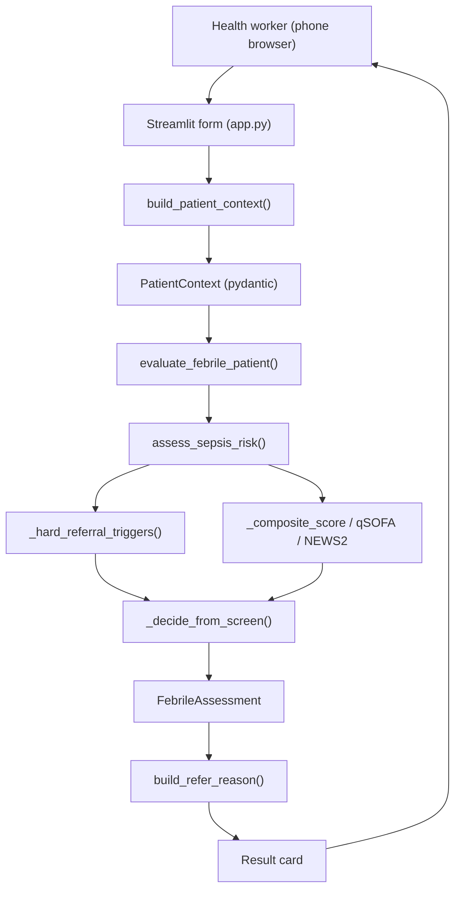

# FeverGate — Engineering Design Doc

**Author:** TBD
**Status:** Draft v0.1
**Last updated:** 2026-06-26
**Reviewers:** TBD

---

## 1. Summary

FeverGate is a non-laboratory treat-or-refer decision aid for febrile patients of all ages. The system is a deterministic Python rule engine (`evaluate_febrile_patient`) wrapped in a single-page Streamlit UI, managed with **uv** via `pyproject.toml`. There is no network service, no database server, and no LLM in the decision path — the entire decision is a pure function over a typed `PatientContext`. The single most interesting engineering choice is making safety a *structural* property: any positive WHO IMCI danger sign at any age flows through one hard-referral gate that short-circuits the rest of the logic, then gets pinned by an exhaustive parametrized test suite (84 tests today).

## 2. Assumptions

- **Target scale:** Single worker on a single device per session; low hundreds of encounters/day per device. No concurrency, no multi-tenant load.
- **Latency budget:** The decision is a local pure function; p99 well under 10ms. The only perceptible latency is Streamlit's rerun, not the engine.
- **Platform:** Mobile-friendly web via Streamlit, run from a phone browser or a hosted demo. Not a native app; not yet an offline PWA.
- **Cost ceiling:** Effectively zero marginal cost per decision (no model calls, no cloud DB). Hosting a Streamlit demo is the only cost.
- **Out of scope:** Multi-region, real-time sync, accounts, lab/RDT integration, SMS/notifications, central registry.

## 3. Goals & non-goals

**Goals (v1):**
- Deterministic, auditable engine returning `REFER_IMMEDIATE` / `REFER` / `TREAT_AND_MONITOR` / `TREAT` with referral reasons.
- Any positive IMCI danger sign, at any age, always yields a referral decision (the safety invariant).
- Neonate (<2 months) with fever always refers immediately.
- A Streamlit triage form → result-card flow usable end-to-end in under 60 seconds.
- Decision latency p99 < 10ms (local pure function); UI swap form→card with no wrong-color flash on referral.

**Non-goals (v1):**
- No LLM anywhere in the decision path — explanation narration is a later, non-deciding layer.
- No persistence beyond in-session `st.session_state`; no encounter database.
- Designed for single-device use; will not scale to a shared multi-user backend without rework — and that's fine.
- No vitals-driven adult pathways beyond the existing qSOFA/NEWS2/composite screen in the engine (vitals UI deferred).

## 4. Architecture



**What's here:**
- **Streamlit app (`app.py`)** — renders form/result; owns `st.session_state` view switching.
- **UI helpers (`src/ui/`)** — `danger_sign_labels.py` (tile metadata), `patient_context.py` (form→model), `refer_reason.py` (human reason lines).
- **Decision engine (`src/decision_engine/`)** — `engine.py` orchestrator + `sepsis_screen.py` rules over `models.py`.
- **Shared label map (`DANGER_SIGN_LABELS`)** — single source of truth for reason wording.

**What's deliberately NOT here:**
- No backend API or server — the engine is imported in-process.
- No database — encounter state lives in `st.session_state` for the session and is discarded.
- No LLM / model service — the decision is a pure function.
- No auth / session service — one worker, one device, zero accounts.

## 5. Key components

### Decision orchestrator — `src/decision_engine/engine.py`

- **Responsibility:** Turn a `PatientContext` into a `FebrileAssessment` (decision, urgency, monitoring days, deduped referral reasons, rationale).
- **Tech choice:** Plain Python + pydantic v2.
- **Why this choice:** Already in the stack; pydantic gives typed, validated inputs for free.
- **Interface:** `evaluate_febrile_patient(ctx: PatientContext) -> FebrileAssessment`.

### Sepsis / danger-sign screen — `src/decision_engine/sepsis_screen.py`

- **Responsibility:** Compute hard-referral triggers, qSOFA, NEWS2, and a composite score, then resolve a decision + urgency.
- **Tech choice:** Pure functions, no I/O.
- **Why this choice:** Determinism and testability — every branch is reachable from a constructed `PatientContext`.
- **Interface:** `assess_sepsis_risk(ctx)`; internals `_hard_referral_triggers`, `_imci_danger_signs`, `_compute_qsofa`, `_compute_news2`, `_composite_score`, `_decide_from_screen`, `_age_band`.

### Domain models — `src/decision_engine/models.py`

- **Responsibility:** Typed inputs/outputs and the canonical `DANGER_SIGN_LABELS` reason map.
- **Tech choice:** pydantic `BaseModel` + `Enum`.
- **Why this choice:** Validation at the boundary; enums prevent invalid decisions/urgencies/consciousness states.
- **Interface:** `PatientContext`, `VitalSigns`, `DangerSigns`, `ConsciousnessLevel`, `Comorbidity`, `TriageDecision`, `ReferralUrgency`, `FebrileAssessment`, `DANGER_SIGN_LABELS`.

### Streamlit UI — `app.py` + `src/ui/`

- **Responsibility:** Render form/result, map tiles → context, build the human reason line, manage form↔card state.
- **Tech choice:** Streamlit; `DANGER_SIGN_TILES` dataclass list for tile metadata.
- **Why this choice:** Fastest path to a mobile-friendly, deployable demo with no frontend build chain.
- **Interface:** `build_patient_context(...)`, `build_refer_reason(referral_reasons, urgency) -> str`.

## 6. Data model

```python
class DangerSigns(BaseModel):
    unable_to_drink_or_breastfeed: bool = False
    vomits_everything: bool = False
    convulsions: bool = False
    chest_indrawing: bool = False
    stiff_neck: bool = False
    bulging_fontanelle: bool = False
    severe_palmar_pallor: bool = False

class PatientContext(BaseModel):
    age_months: int = Field(ge=0)
    has_fever: bool = True
    fever_duration_days: int = Field(default=1, ge=0)
    consciousness: ConsciousnessLevel = ConsciousnessLevel.ALERT
    toxic_appearance: bool = False
    comorbidities: list[Comorbidity] = Field(default_factory=list)
    vitals: VitalSigns = Field(default_factory=VitalSigns)
    danger_signs: DangerSigns = Field(default_factory=DangerSigns)

class FebrileAssessment(BaseModel):
    sepsis: SepsisScreenResult
    decision: TriageDecision
    urgency: ReferralUrgency
    monitoring_days: int = 0
    referral_reasons: list[str] = Field(default_factory=list)
    rationale: list[str] = Field(default_factory=list)
```

**Notes:**
- No indexing / no tables — `st.session_state` holds the current `FebrileAssessment` only.
- Retention: session-scoped; cleared on "New patient" or browser close. No PII leaves the device.
- `referral_reasons` are stable string codes (e.g. `imci:convulsions`, `neonate_fever`); human wording is resolved via `DANGER_SIGN_LABELS`.

## 7. API surface

FeverGate has no network API. The internal call graph:

### `evaluate_febrile_patient(ctx: PatientContext) -> FebrileAssessment`

- **Input:** A validated `PatientContext`.
- **Output:** `FebrileAssessment` with `decision`, `urgency`, `monitoring_days`, sorted/deduped `referral_reasons`, and `rationale`.
- **Errors:** Invalid inputs rejected at construction by pydantic.
- **Latency budget:** Pure CPU, no I/O; p99 < 10ms.

### `build_refer_reason(referral_reasons: list[str], urgency: ReferralUrgency) -> str`

- **Input:** Engine reason codes + urgency enum.
- **Output:** One human line, e.g. `"Convulsions — refer immediately."`
- **Errors:** Unknown codes skipped; empty result falls back to `"Elevated severe-illness screen — refer immediately."`
- **Latency budget:** Negligible (string assembly).

## 8. Key trade-offs (with rejected alternatives)

### Decision: Deterministic rule engine vs. LLM-in-the-loop

- **Chose:** Pure-function rule engine; no model in the decision path.
- **Considered:** LLM that reads inputs and recommends treat/refer; hybrid where LLM adjusts rule output.
- **Why we picked this:** Safety must be auditable and reproducible. An LLM can hallucinate "treat" over a danger sign. We give up flexible natural-language reasoning we don't need for a tap-based form.

### Decision: Apply IMCI danger signs at all ages vs. under-5 only

- **Chose:** Any positive IMCI danger sign hard-refers at every age.
- **Considered:** Gating IMCI signs to neonate/under-5 (original protocol scope).
- **Why we picked this:** The safety promise is "a positive danger sign always refers." An age gate let an 8-year-old with chest indrawing fall through to TREAT_AND_MONITOR — a false negative we refuse.

### Decision: uv + pyproject.toml vs. requirements.txt only

- **Chose:** `uv` with `pyproject.toml` and `uv.lock` for reproducible dev environments.
- **Considered:** `pip install -r requirements.txt` only.
- **Why we picked this:** Lockfile reproducibility and faster sync on Windows dev machines; `uv run` wraps pytest and streamlit cleanly.

### Decision: Streamlit vs. custom web frontend

- **Chose:** Streamlit single-page app.
- **Considered:** React/Next PWA; native mobile.
- **Why we picked this:** Ships a mobile-friendly UI with zero build chain for a submission timeline. We give up fine-grained snap animation control — acceptable for v1.

## 9. Risks & unknowns

- **Clinical correctness of thresholds** — Likelihood: med — Mitigation: pin behavior with golden tests; flag for clinician review before field use.
- **Over-referral in older children from all-age danger signs** — Likelihood: med — Accepted: false positives are tolerable; false negatives are not.
- **Streamlit rerun flicker on form→card snap** — Likelihood: low — Mitigation: gate rendering on single `show_result` flag.
- **Reason wording drifts from engine codes** — Likelihood: low — Mitigation: `DANGER_SIGN_LABELS` consumed by both UI and tests.
- **Misuse as a diagnosis tool** — Likelihood: med — Mitigation: explicit "screening only" caption in UI.

## 10. Testing strategy

Runner: **pytest** via `uv run pytest tests/ -v`. Tests live in `tests/` with `pythonpath = ["src"]` in `pyproject.toml`. No browser automation, no visual regression.

**Unit tests (must have):**
- `_hard_referral_triggers(ctx)` in `sepsis_screen.py` — every IMCI danger sign produces its `imci:*` trigger at under-5 (24 mo) and school-age (96 mo); convulsions also emits bare `"convulsions"` for backward compatibility. **File:** `tests/test_sepsis_internals.py`
- `_imci_danger_signs(ctx)` — each `DangerSigns` boolean and `ConsciousnessLevel.LETHARGIC` / `UNCONSCIOUS` maps to the expected trigger code; no sign set → empty list. **File:** `tests/test_sepsis_internals.py`
- `_age_band(age_months)` — boundaries: 1→neonate, 2→under5, 59/60, 144, 216, 780→elderly. **File:** `tests/test_sepsis_internals.py`
- `_compute_qsofa(ctx)` — returns `None` under 12 years; for adults, ≥2 when lethargic + low SBP + high RR combine. **File:** `tests/test_sepsis_internals.py`
- `_compute_news2(ctx)` — returns `None` when RR missing or under 12 years; high derangement pushes score ≥7. **File:** `tests/test_sepsis_internals.py`
- `_composite_score(ctx)` — neonate age points, hypothermia, lethargy, comorbidities, prolonged fever, toxic appearance each surface in `score_components`. **File:** `tests/test_sepsis_internals.py`
- `evaluate_febrile_patient(ctx)` — `monitoring_days == 3` only for `TREAT_AND_MONITOR`; `referral_reasons` sorted and deduplicated; rationale populated. **File:** `tests/test_engine.py`
- `build_refer_reason(reasons, urgency)` in `src/ui/refer_reason.py` — `["imci:convulsions"]` + IMMEDIATE → `"Convulsions — refer immediately."`; SAME_DAY phrasing; dedupe; unknown-only fallback. **File:** `tests/test_refer_reason.py`
- `DANGER_SIGN_LABELS` — every `imci:*` code emitted by `_imci_danger_signs` has a label entry. **File:** `tests/test_sepsis_internals.py`
- Parametrized danger-sign safety net — 9 signs × 2 age bands → always REFER/REFER_IMMEDIATE. **File:** `tests/test_danger_signs.py`

**Integration tests (one per major flow):**
- **Danger-sign refer flow** — convulsions at age 24 → `REFER_IMMEDIATE` with `convulsions` and `imci:convulsions` in reasons. **File:** `tests/test_integration_flows.py`
- **Neonate fever refer flow** — age 1 with fever → `REFER_IMMEDIATE` with `neonate_fever`. **File:** `tests/test_integration_flows.py`
- **Uncomplicated fever monitor flow** — under-5, mild vitals, no danger signs → `TREAT_AND_MONITOR`, `monitoring_days == 3`. **File:** `tests/test_integration_flows.py`
- **Adult deterioration flow** — adult with qSOFA-positive vitals → `REFER` or `REFER_IMMEDIATE`. **File:** `tests/test_integration_flows.py`
- **UI→engine path** — `build_patient_context()` with convulsions tile selected → referral decision. **File:** `tests/test_integration_flows.py`

**Deliberately not tested (and why):**
- Streamlit rendering, CSS, tile layout, and the snap transition — visual/runtime UI; verified by human walkthrough.
- Exact composite-score arithmetic beyond documented thresholds — we test decision boundaries, not every internal point value.
- pydantic's own validation internals — trust the library.
- Clinical accuracy of WHO thresholds — clinician review, not a unit test.
- Gemini / LLM API calls — no LLM in v1 decision path; nothing to mock.

**Stack default:** Python → `pytest`. Run: `uv run pytest tests/ -v`. Current suite: **84 tests, all passing**.

## 11. Rollout & monitoring

- **Rollout:** Hosted Streamlit demo for submission/review first; supervised pilot only after clinician sign-off.
- **Feature flags:** None in v1 — single decision path ships whole.
- **Monitoring:** In a pilot: refer-rate by age band, any human-reported false negative (page-worthy), form-completion time (<60s UX bar).
- **Rollback plan:** Redeploy previous commit or take demo offline. No data migration.

## 12. Cost & capacity

- **Per-decision cost:** ~$0 — pure local computation, no model calls.
- **Monthly budget at v1 scale:** Cost of hosting one Streamlit instance only. Effectively negligible.
- **What breaks at 10× scale:** Nothing about the decision (CPU-trivial). Multi-clinic shared encounter data is the first revisit — deliberately not designed now.

## 13. Open questions

- [ ] Should lethargic/unconscious be one tri-state input or two tiles? — UX + Eng
- [ ] Do we add a session-local encounter log (SQLite) in v1? — Product owner
- [ ] Which malaria-endemicity / presumptive-treatment rules enter the TREAT branch? — Clinical reviewer
- [ ] What does "Refer now" record — no-op or encounter-log hook? — Product + Eng

## 14. Out of scope (will not do)

- **No backend service or REST API** — engine imported in-process.
- **No database or cloud registry** — must not block the bedside decision.
- **No LLM in the decision** — only ever a non-deciding explanation layer, later.
- **No lab/RDT input, SMS/notifications, accounts** — explicit product non-goals.
- **No offline-installable PWA in v1** — Streamlit demo first.
